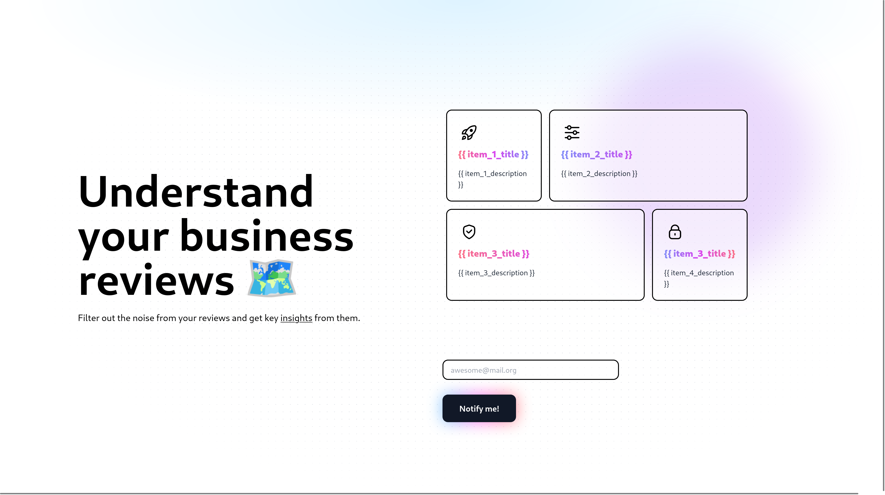

# landings

A simple landing website for templating by substituting the {{ content }} variables.

> You can see tablet and mobile screenshots in the `screenshots` directory.

## Development

We are using [tailwind css](v2.tailwindcss.com) with plain html.

1. `npm install -D` to install project dependencies
2. `npx postcss -w src/tailwind.css -o src/style.css` to regenerate the css file
3. `npx live-server` to serve the files

## Variables

The following variables are available for substitution:

- `{{ title }}` - The title of the page
- `{{ analytics_html }}` - Allows injection of html code for analytics
- `{{ page_identifier }}` - Page identifier to save the registered emails to (sent on the form)
- `{{ tagline }}` - Short text to describe the page
- `{{ description }}` - The description to show below the tagline
- `{{ item_1_title }}` - Title for top left item in the gridbox
- `{{ item_1_description }}` - Description for top left item in the gridbox
- `{{ item_2_title }}` - Title for top right item in the gridbox
- `{{ item_2_description }}` - Description for top right item in the gridbox
- `{{ item_3_title }}` - Title for bottom left item in the gridbox
- `{{ item_3_description }}` - Description for bottom left item in the gridbox
- `{{ item_4_title }}` - Title for bottom right item in the gridbox
- `{{ item_4_description }}` - Description for bottom right item in the gridbox
- `{{ button_text }}` - Text for the button next to the email input field
- `{{ button_attributes }}` - Additional attributes for the button, e.g. `data-umami-event="button"`

> Form method is always POST
